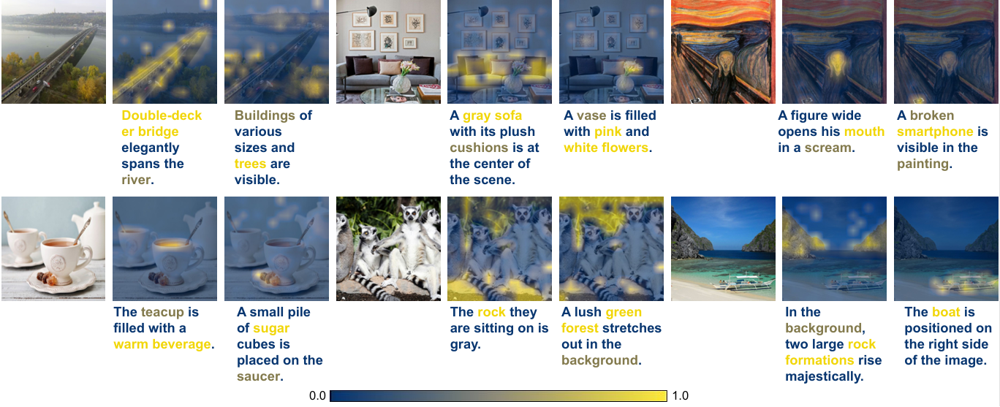

# COSMOS: Cross-Modality Self-Distillation for Vision Language Pre-training [[Arxiv]](https://arxiv.org/abs/2412.01814)
[](https://arxiv.org/abs/2412.01814)
[](https://huggingface.co/sankim2/cosmos)


**Authors:** [Sanghwan Kim](https://kim-sanghwan.github.io/), [Rui Xiao](https://www.eml-munich.de/people/rui-xiao), [Mariana-Iuliana Georgescu](https://lilygeorgescu.github.io/), [Stephan Alaniz](https://www.eml-munich.de/people/stephan-alaniz), [Zeynep Akata](https://www.eml-munich.de/people/zeynep-akata)

### Abstract
Vision-Language Models (VLMs) trained with contrastive loss have achieved significant advancements in various vision and language tasks. However, the global nature of contrastive loss makes VLMs focus predominantly on foreground objects, neglecting other crucial information in the image, which limits their effectiveness in downstream tasks. To address these challenges, we propose COSMOS: CrOSs-MOdality Self-distillation for vision-language pre-training that integrates a novel text-cropping strategy and cross-attention module into a self-supervised learning framework. We create global and local views of images and texts (i.e., multi-modal augmentations), which are essential for self-distillation in VLMs. We further introduce a cross-attention module, enabling COSMOS to learn comprehensive cross-modal representations optimized via a cross-modality self-distillation loss. COSMOS consistently outperforms previous strong baselines on various zero-shot downstream tasks, including retrieval, classification, and semantic segmentation. Additionally, it surpasses CLIP-based models trained on larger datasets in visual perception and contextual understanding tasks. 

## Methodology


## Pre-trained Models

We released the pre-trained FLAIR models on [Huggingface](https://huggingface.co/xiaorui638/flair). The pre-trained models, their corresponding pre-trained datasets, and R@1 retrieval results on COCO and Flickr are listed below. For the full results please see the [paper](https://arxiv.org/pdf/2412.03561). Generally, FLAIR shares a similar architecture as the `ViT-B-16` model in [OpenCLIP](https://github.com/mlfoundations/open_clip), therefore also having similar number of parameters (150M vs 149M), the extra 1M parameters come from the text-conditioned attention pooling layer in FLAIR.


## Qualitative Results

We visualize the attention weights of image and text cross-attention modules. Patch-wise (image) and token-wise (caption) attention weights are both normalized between 0 and 1.



## Acknowledgements
We thank [OpenCLIP](https://github.com/mlfoundations/open_clip) for providing the amazing code base. Meanwhile, we acknowledge [DreamLIP](https://github.com/zyf0619sjtu/DreamLIP) and [PixelProse](https://huggingface.co/datasets/tomg-group-umd/pixelprose) for providing us with various pre-training datasets with captions from MLLMs. We are also greateful for [SCLIP](https://github.com/wangf3014/SCLIP) for providing the the detailed scheme for semantic segmentation task.

## Citations
If you find our work useful, please star this repo and cite:

```bibtex
@article{kim2024cosmos,
  title={COSMOS: Cross-Modality Self-Distillation for Vision Language Pre-training},
  author={Kim, Sanghwan and Xiao, Rui and Georgescu, Mariana-Iuliana and Alaniz, Stephan and Akata, Zeynep},
  journal={arXiv preprint arXiv:2412.01814},
  year={2024}
}
